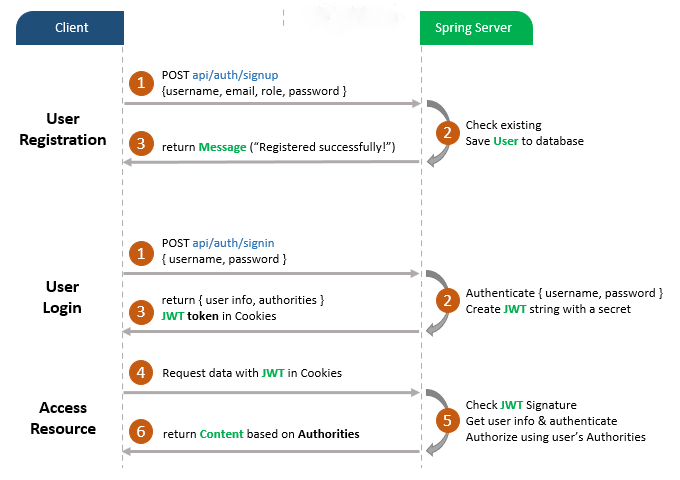
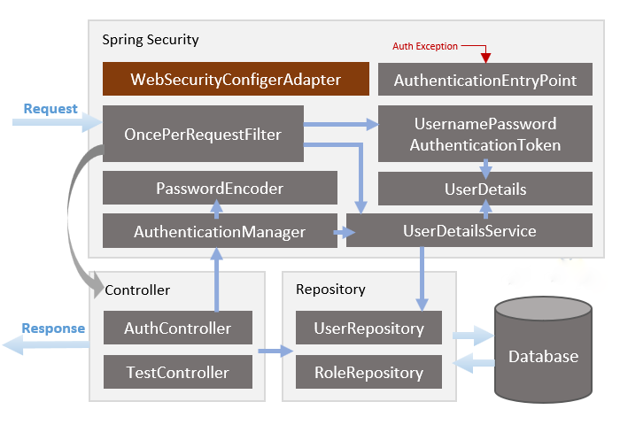

# Spring Boot Security Login example with JWT and H2 example

- Appropriate Flow for User Login and Registration with JWT and HttpOnly Cookie
- Spring Boot Rest Api Architecture with Spring Security
- How to configure Spring Security to work with JWT
- How to define Data Models and association for Authentication and Authorization
- Way to use Spring Data JPA to interact with H2 Database

## User Registration, Login and Authorization process.

## Spring Boot Server Architecture with Spring Security
You can have an overview of our Spring Boot Server with the diagram below:

## Run & Check

Run Spring Boot JWT Security application

Check H2 database connection with url: http://localhost:8080/h2-ui

Click on Connect button, tables defined in models package will be automatically generated in Database.

Add rows into roles table before assigning any role to User.
Run following SQL insert statements:

    INSERT INTO roles(name) VALUES('ROLE_USER');
    INSERT INTO roles(name) VALUES('ROLE_MODERATOR');
    INSERT INTO roles(name) VALUES('ROLE_ADMIN');

Register 3 users with /signup API:

method = POST; URL = http://localhost:8080/api/auth/signup

1) BODY:

    {
       "username": "mod",
       "email": "mod@mail.com",
       "password": "qwerty",
       "role": [
       "mod",
       "user"
       ]
    }

2) BODY:

    {
        "username": "user",
        "email": "user@mail.com",
        "password": "qwerty1",
        "role": [
        "user"
        ]
    }

3) BODY:

    {
        "username": "admin",
        "email": "admin@mail.com",
        "password": "qwerty2",
        "role": [
        "admin"
        ]
    }

Access public resource: GET http://localhost:8080/api/test/all
response body:

    Public Content.

Access protected resource without Login: GET http://localhost:8080/api/test/user
response body:

    {
        "path": "/api/test/user",
        "error": "Unauthorized",
        "message": "Full authentication is required to access this resource",
        "status": 401
    }

Login an account: POST http://localhost:8080/api/auth/signin
BODY:

    {
        "username": "mod",
        "password": "qwerty"
    }

response body:

    {
        "id": 1,
        "username": "mod",
        "email": "mod@mail.com",
        "roles": [
        "ROLE_USER",
        "ROLE_MODERATOR"
        ]
    } 

    + JWT COOKIE

Access ROLE_USER and ROLE_MODERATOR resource:

    – GET http://localhost:8080/api/test/user
    – GET http://localhost:8080/api/test/mod

response body:

    User Content.
    Moderator Board.

Access ROLE_ADMIN resource: GET http://localhost:8080/api/test/admin, response will be:

    Status: 403 Forbidden

Logout the Account: POST http://localhost:8080/api/auth/signout
response body:

    {
        "message": "You've been signed out!"
    }

